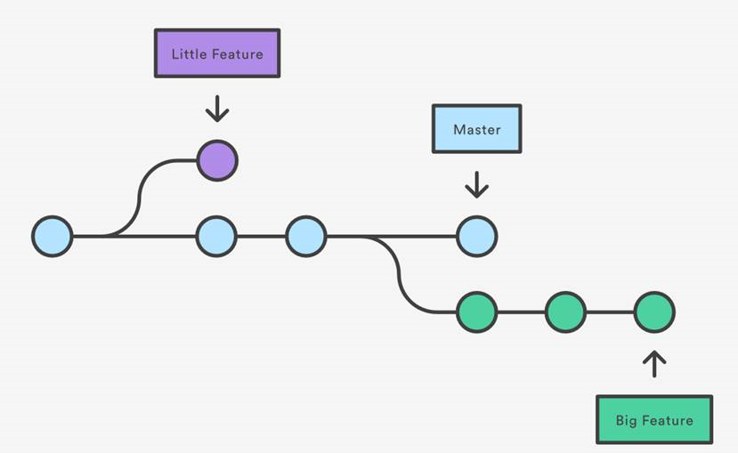

```{r setup, include=FALSE}
knitr::opts_chunk$set(echo = TRUE, message = F)
```

...Gooey Git? Why's git gooey?
Ah ha, well you know a GUI - a graphical user interface? Computer people pronounce that as _gooey_. Just as they also pronunce SQL _sequel_. So, if you want to impress, make friends, or attempt to seduce computer people, use those pronounciations and you'll be grand. 

# Introduction

Yo and behold folks. Beneath, y'all shall see how to start using git with your analytical projects. 

> Git is the best version control system for files (as at 2019)

In doing so, you will be using the latest and greatest version control system to:

 * make your analysis more auditable; 
 * forever banish annoying manual version control like .v2, .v3, .v3final, .v4FINALFINAL!!!!!!; and, 
 * make QA of code easier
 
But to reap these benefits, y'all need to know how to use git. Well hang tight, 'cause I'll show you just how to do that below...

## BUT, we need an R Project first

Before we go any further, we need to get oragnised. Anytime you do analytical work that requires code (such as SQL and R scripts), you should create an [R project](https://support.rstudio.com/hc/en-us/articles/200526207-Using-Projects). This just creates a folder in file explorer where you can house all documents related to the work you're doing. It also (once you've installed and configured git, which shall be shown in the next section) generates a git repository in that folder, allowing you to version control the files in that folder. 

Also, git works best on code files (R, SQL, Python, text files) as it records the difference between different versions. It's not _that_ good on files like Excel and Word, as those files are not in binary, thus you can't see where the differences are between different versions (when you look at committed files like this in the history pane, you will just see scrambled symbols). Thus, I'd advise to just use git to record changes in your code files, and then commit excels or R Markdowns you send off to customers for record-keeping.

# Installation and configuration 

As iconic a duo as Laurel and Hardy...

<iframe src="https://giphy.com/embed/2gcmmuaqnfMt2" width="480" height="347" frameBorder="0" class="giphy-embed" allowFullScreen></iframe><p><a href="https://giphy.com/gifs/cheezburger-fail-2gcmmuaqnfMt2">via GIPHY</a></p>

...installation and configuration are just as prone to mishaps and nice messes. This section will show you how to do them properly. 

## Installation

First, download git from the [official website](https://git-scm.com/downloads). Use *anything except Internet Explorer*, because the last time I tried to download it with IE, it didn't work. Then just follow the on-screen prompts to get it downloaded onto your computer. 

## Configuration

To then configure RStudio to use git, you do the following

>* Open RStudio
 * Click _Tools_ -> _Global Options_ -> _Git/SVN_
 * If _Git executable shows (none)_, click _Browse_ and select the git executable installed on your system
 * On Windows, `git.exe` will likely be somewhere in `Program Files`
 * Click _OK_
 
You have now attached Git to your RStudio. This will allow you to create new R Projects that have git in them. To do that, create a new project by clicking on the drop down button _Project (None)_ in the top right of RStudio, select new project, and then ensure that you tick _Create a git repository_. 


And *boom*, you're ready to _git_ on it. So let's _git_ with it. 
 
# Gitting it on in an R Project

In git, you work with files in R as you normally do. Then, once you’ve hit a stage where you want a *save* of where you’re at (usually after adding a big-enough change to your code that makes it do something new that it didn't do before the change), you save the files you’re working with, `stage` them by clicking the boxes to the left of the files in the Git pane, and then `commit` those staged files with the commit button.


Once you do this, you’ll be prompted to add a message to the *changes you want to commit*. Think of it like saving Tomb Raider, or Medal of Honor. The moment you save the progress you’ve made in that game, you can go back to that point if you want. The act of *committing* a set of files is just you saving the progress you’ve made in that code – allowing you to go back to that point if you want. Only the difference here is that you say, in the commit message, what you did between your last save and this one.

Once you hit the commit button, you’ll be directed to a pop-up window. You insert a message into the _Commit message_ pane briefly saying what you did in this current commit:


You’ll also see a load of coloured lines in the files you staged. This shows how those files changed between the last commit and the current one. Green lines show lines that were added, while [coral lines](https://www.pantone.com/color-intelligence/color-of-the-year/color-of-the-year-2019) show ones which were removed. 

Now just hit _Commit_, and that’s your progress saved.  

# Your History is mine

If you have opened someone else’s project, and wanted to see what progress they made with their code, you can just call up the History of their commits. To do so, just hit the _History_ button, and start snoopin’:


You’ll then see a series of commits the previous analyst made. You’ll see the commit messages they wrote by the _Subject_ row, see which files they staged/committed below the _Parent_ row, and see what lines were added/removed in the code below:


# I wanna Branch like a tree

Say for some reason (QA, Policy want experimental analysis, several people need to work on the project), you need to create a wholly new version of a file. Instead of doing the File_v1, file_v2, file_final_v1, file_final_v2 format, you just make a new `branch` in the path of your Git commits and switch to that. To borrow the game analogy, imagine if you’re playing _Civilisation_, and you want to see what would happen if your country went to war with another. You’d save the game just before you went to war, then go to war and see what happens. 

If, though, things didn’t work out well for your civilisation, you would just load your game from before you went to war, and continue on independently to what you did before you went to war. 

The same logic applies here. By creating a branch, you are allowing files to be edited, whilst keeping an original version of them to revert back to if you need or want to. Here’s a nice picture of what this looks like (where Master is the default) version:



To create a new branch in RStudio, just hit the button:


 ...and name it:
 

 
Then to view and switch between branches, just click to the right of the ‘New Branch’ button. If you want to switch between branches, just click them:
 


When you select a branch, the state of the files that you committed in that branch will appear in both the _Files_ pane in RStudio, and in your Windows file explorer. This may take a while to get used to, but in the long run is beneficial, as you're only seeing the version of files that you are interested in at that moment.  

# Come together, together as one

But say folks that you've been working on a different branch for a while, and now want to use this code for your work. For example, imagine that policy asked for experimental analysis on the work you were doing, you worked on that in branch, and then they said they now want the experimental analysis. You would then `merge` your experimental branch with the master one, effectively joining the work you did in the experimental branch with the main one of the project. 

To do that, we have to venture outside the GUI _gasp_ into the land of the command line...

> Here's be me; 'Dragons'

To enter such wild lands, *either* click on the Shell option in the GUI:


*or* call the terminal up in the lower left pane of RStudio:


*Then* once you've done either of the two, enter the following command in:

`git merge x`

where 'x' is the branch you want to merge into your master one. Mine looks like this:


One of the dangers of venturing out into the command line are the nefarious computer errors lurking, waiting to pounce at the first sign of weakness. Such a monster is the enmity-sounding `merge conflict`. This relates to a situation where a file in your new branch has content that that file in the master branch doesn't have; _and_ that file in the master branch has content that the new branch file doesn't. If this happens to you, [watch Youtube](https://www.youtube.com/watch?v=g8BRcB9NLp4), and it will save your day. 

Usefully, merged branches are also visualised in the History tab of the git GUI. You can then quickly see where and how changes were enacted in your code, and also get a quick sense of the various versions of your files. Plus, if nothing else, the branches are colourful:


# Benefits

You know running? That aerobic exercise where you're wheezing, tired, get sore legs and knees after a while, and maybe even get blasted with rain and wind if you do it outside? Where you get home all covered in sweat, limping down the corridor feeling sticky and _gooey_? 

Well, doing that for an hour adds about [seven hours onto your life](https://www.nytimes.com/2017/04/12/well/move/an-hour-of-running-may-add-seven-hours-to-your-life.html)

In the case of running, putting yourself under a bit of hassle now leads to positive outcomes in the long-run. By putting the effort in and going for a run, you're going to garner a variety of long-term [mental](https://digest.bps.org.uk/2017/04/19/10-ways-that-running-changes-your-mind-and-brain/) and [physical](https://thepsychologist.bps.org.uk/volume-30/may-2017/minds-run-free) benefits. 

It's the same thing we git. By putting yourself under a bit of hassle now to record what you do, and creating and managing branches when you need to add a major different feature to code, you are garnering a variety of long-term benfits like:

 * creating a clear, auditable trail of how you created your code for QA, and for your own record;
 * improving knowledge management by documentating why you made changes in the commit messages; and,
 * preventing cluttered and confusing folders by using branches to keep files with different contents and features seperate. 
 
You will thus contribute to the converging analytical trend of making your work more auditable, explanable, and reporducible. 

# Tell me more, tell me more

If you want to learn more about Git, or want to venture further into command line land, then there's a plethora of resources to choose from:

 * For a tutorial on Git using the command line, check out Zach Waller's [stellar PowerPoint presentation](https://educationgovuk.sharepoint.com/sites/sarpi/g/WorkplaceDocuments/Forms/AllItems.aspx?RootFolder=%2Fsites%2Fsarpi%2Fg%2FWorkplaceDocuments%2FInducation%20learning%20and%20career%20development%2FCoffee%20and%20Coding%2F170816%5Fzach%5Fgit&FolderCTID=0x012000C61C1076C17C5547A6D6D8C2A27B5D97); 
 * DfE's *VSTS for Analysis* book has a [section on Git](https://dfe-analytical-services.github.io/vsts-for-analysis/version-control-using-git-the-basics.html); and,
 * The surpeme resource on Git is the [Pro Git](https://git-scm.com/book/en/v2) book. It is the best reeference resource out there, and should be consulted if you encounter problems beyond the scope of committing, branching, and merging. 

# Conclusion

I've shown you how to install and configure git with RStudio, how to commit changes, and how to create and merge branches to create amendmenets to files. Benefits have also been given as to why you should start incorporating git into your analytical workstream. 
If you decide to put the work in now with git, you'll garner the long-term benfits of auditability, explainability, and reproducibility forever and ever more. 

